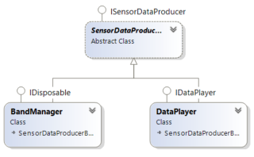

# BandSlider
Control PowerPoint with the Microsoft Band 2


##Basel

Is a gesture library to receive data from the Microsoft Band 2 easily. It can be used for detecting gestures and also storing and replaying sensor readings.
The stored gestures can also be written to the filesystem, for later use. The library contains 
an extensible set of recognition algorithms which can be used e.g. by the detectors. 

A detector takes a set of template gestures and a for each gesture a 
correlating delegate which gets invoked when one of the assigned gesture was detected by incoming sensor readings from the producer (e.g. MSBand or Player).


Basel uses the *ConsumerProducer* pattern to connect the modules with each other.



###Configuration

The basel configuration class ist the configuration for all *Basel* modules, at the time, this is only used to activate sensors.

###Detection

For detection, Basel provides 3 base classes and its interface. The first of them is *Gesture*, this class is a container with sensor readings, a name and a length. The others are  Recognizer and Detector.

####Recognizers

In this namespace, you will find some algorithms to recognize gestures. For all this *Recognizers*, you should use the Recognizer base class.


####Detectors

In this namespace, there are gesture detectors which are using the recognizers to detect gestures at runtime for different sensors.


###Recorder

This namespace has a *Recorder*, a *Player* and the persistence module.

####Persistance

The recorded data can be stored to a file, by using the JSONSerial

```c#
{
  "$type": "Basel.Record, Basel",
  "Accelerometer": [
    {
      "$type": "Basel.SensorReadings.BaselBandAccelerometerReading, Basel",
      "AccelerationX": 0.88427734375,
      "AccelerationY": -0.361328125,
      "AccelerationZ": -0.2197265625,
      "Timestamp": "2016-06-21T21:14:31.424092+02:00"
    },
  ], 
  "Altimeter": [], 
  "AmbientLight": [], 
  "Barometer": [], 
  "Calories": [],
  "Contact": [], 
  "Distance": [], 
  "Gsr": [], 
  "Gyroscope": [], 
  "HeartRate": [],
  "Pedometer": [],
  "RRInterval": [], 
  "SkinTemperature": [], 
  "UV": []
}
```

###Filter

In this namespace ther are some filters which can used.

##UWP Sample APP

This app could be used to test the functionality of the *Basel* (e.g. Record, Play, Recognize, Detect, Save, Restore, SensoreSelection,..)


###BandTile

To control a powerpoint presentation also from the band, we created a sample tile, which sends button events to the UWP app.


##SliderCtrl

Is a Powerpoint AddIn which opens an REST interface to control the presentation remotely. This is used py the sample app to use gestures to control a presentration.  

```c#
    public partial class ThisAddIn
    {
        private HttpSelfHostServer _server;

        private void ThisAddIn_Startup(object sender, System.EventArgs e)
        {
            var config = new HttpSelfHostConfiguration("http://localhost:5000");

            config.Routes.MapHttpRoute(
                "API Default", "api/{controller}/{action}/{id}",
                new { id = RouteParameter.Optional });

            _server = new HttpSelfHostServer(config);
            _server.OpenAsync().Wait();
        }

        private void ThisAddIn_Shutdown(object sender, System.EventArgs e)
        {
            if (_server != null)
                _server.Dispose();
        }
    }
```
